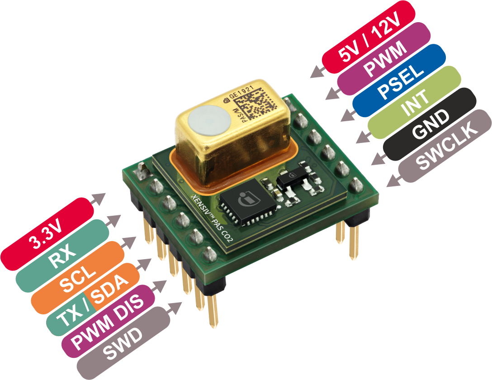

.. _arduino-getting-started:

Getting Started
================

.. warning::
    This project is under development and not ready for use.

In this quick tutorial we will go through one of the XENSIV™ PAS Gas sensors examples, using the Rapid IoT connect developer kit (CYSBSYSKIT-DEV-01) and the PAS CO2 Miniboard.

Required Hardware
-----------------

.. list-table::
     :widths: 50 50
     :header-rows: 1

     * - Name
       - Picture
     * - `XENSIV™ PAS CO2 Miniboard <https://www.infineon.com/evaluation-board/EVAL-PASCO2-MINIBOARD>`_
         - .. image:: img/pas-co2-miniboard.png
                    :height: 80
     * - `Rapid IoT connect developer kit (CYSBSYSKIT-DEV-01) <https://www.infineon.com/evaluation-board/KIT-CSK-BGT60TR13C/>`_
         - .. image:: img/csk_baseboard.png
                    :height: 80
     * - Micro-USB to USB A cable
         -
         
In case of using the miniboard, the following items are also required:

    * Jumper cables

Required Software
-----------------

* `Arduino IDE <https://www.arduino.cc/en/main/software>`_
* `arduino-core-psoc6 <https://github.com/Infineon/arduino-core-psoc6>`_
* `XENSIV™ PAS Gas Sensors Arduino library <https://github.com/Infineon/arduino-xensiv-pas-gas-sensor>`_

Software Installation
---------------------

1. **Install Arduino IDE**. If you are new to Arduino, please `download <https://www.arduino.cc/en/Main/Software>`_ the program and install it first.

2. **Install PSOC6 Board**. The official Arduino boards are already available in the Arduino software, but other third party boards such as Infineon's PSOC™ 6 need to be explicitly included. Follow the instructions in the `installation guide <https://arduino-core-psoc6.readthedocs.io/en/latest/installation-instructions.html>`_ to add the PSOC6 board family to Arduino.

3. **Install the library**. In the Arduino IDE, go to the menu *Sketch > Include library > Library
   Manager*. Type **XENSIV PAS Gas Sensors** and install the library.

    .. image:: img/ard-library-manager.png
        :width: 500

Hardware Setup
--------------

For this example we are going to use the I2C interface with the PAS CO2 Miniboard and Rapid IoT connect developer kit (CYSBSYSKIT-DEV-01).

Add 10 Kohm pull-up resistors to the SDA and SCL lines, and provide 5VDC to the VDD5V pin. Connect the boards as shown in the following diagram:

.. image:: img/
    :width: 600

Connect the Rapid IoT Connect Developer Kit to your computer with the USB cable.

With everything ready, now we are going to upload and run one of the library examples. 

1. **Select the board** 

    Once installed the PSoC6 board family, you can select the Rapid IoT Connect Developer Kit from the menu *Tools > Board:*.
    Choose **CYSBSYSKIT-DEV-01** depending on your hardware setup (*Tools > Board > Infineon PSoC6 > CYSBSYSKIT-DEV-01*).

2. **Open the example**

    With the library installed in the Arduino IDE, you can include it from the menu *Sketch > Include Library > XENSIV PAS Gas Sensors*. The header ``#include <pas-gas-ino.hpp>`` will be added to your sketch.
    Open and run one of the examples provided in *File > Examples > XENSIV PAS Gas Sensors*.

    Try the continuous mode example for I2C: *File > Examples > XENSIV PAS Gas Sensors > continuous-mode*.
 

3. **Build and run the example**

    Select the proper COM port ( *Tools > Port*), and then verify |ver-but| the example and upload it the target |upl-but| . 

    Finally, we can check the monitor output |ser-but|. Do not forget to select the proper baudrate for the serial terminal. You can blow into the sensor to see how the CO2 values change |:smiley:|. 

    .. image:: img/ard-monitor-example.png
        :width: 500

.. |ver-but| image:: img/ard-verify-button.png
                :width: 17

.. |upl-but| image:: img/ard-upload-button.png
                :width: 17

.. |ser-but| image:: img/ard-serial-button.png
                :width: 17

What's next?
------------

This is just the start |:rocket:| !

Check out the rest of the available :ref:`library examples <lexamples>` and find out more about the library functions in the :ref:`API reference <api-ref>` section.
