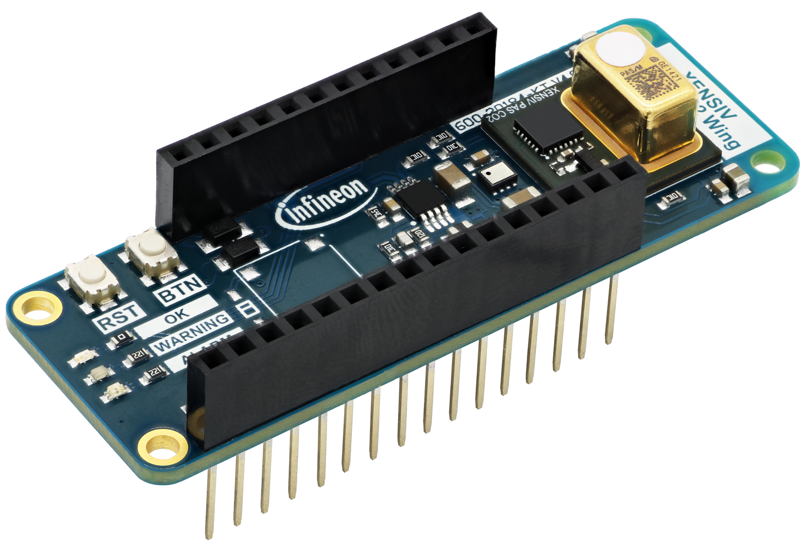
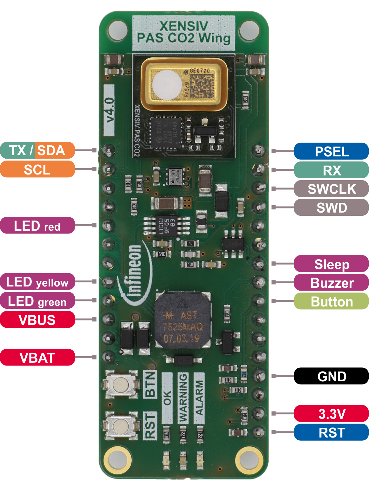

Hardware Platforms
==================

Supported Sensor Boards
-----------------------

This library supports almost all XENSIV™ PAS Gas Sensors family. This includes the mini boards, wing boards as well as the Shield2Go boards of the sensors. Following you will see a list of boards which are
supported by this library.

XENSIV™ PAS CO2 Sensor Shield2Go
""""""""""""""""""""""""""""""""

 .. image:: img/pas-co2-s2go-front.png
    :width: 300

* `XENSIV™ PAS CO2 Shield2Go product page <https://www.infineon.com/evaluation-board/SHIELD-PASCO2-SENSOR/>`_
* `Quick Start Guide Shield2Go <https://www.infineon.com/assets/row/public/documents/24/44/infineon-quickstart-guide-pas-co2-shield2go-usermanual-en.pdf>`_ (for Arduino)

Pinout Diagram
^^^^^^^^^^^^^^

.. image:: img/shield2go_co2_pinout.png
    :width: 350

.. warning:: 
    All signal pins run on 3.3V logic!

Pin Description
^^^^^^^^^^^^^^^

.. list-table::
    :header-rows: 1

    * - Pin Name
      - Description
    * - 5V
      - 5V supply input.
    * - SDA
      - I2C SDA (serial data).
    * - SCL
      - I2C SCL (serial clock).
    * - GND
      - Supply and signal ground.
    * - 3.3V
      - 3.3V supply input - use as logic supply when using breakable part stand-alone, else keep NC.
    * - INT
      - Interrupt output.
    * - PWM
      - PWM signal output.
    * - TX
      - UART transmit side.
    * - RX
      - UART receive side.
    * - PSEL
      - Communication interface selection.
    * - PWM DIS
      - PWM disable input (set high to disable PWM).
    * - 5V
      - 5V supply input - use as sensor supply when using breakable part stand-alone, else keep NC.
    * - TX/SDA
      - UART transmit or I2C SDA (serial data), depending on selected communication interface.
    * - SWD
      - Serial wire debug data (keep NC).
    * - SWCLK
      - Serial wire debug clock (keep NC).

XENSIV™ PAS CO2 Miniboard
"""""""""""""""""""""""""

.. image:: img/pas-co2-miniboard.png
    :width: 200

* `XENSIV™ PAS CO2 Miniboard product page <https://www.infineon.com/evaluation-board/EVAL-PASCO2-MINIBOARD>`_
* `XENSIV™ PAS CO2 Miniboard documentation <https://www.infineon.com/evaluation-board/EVAL-PASCO2-MINIBOARD#documents>`_
* `XENSIV™ PAS CO2 5V Miniboard product page <https://www.infineon.com/evaluation-board/EVAL-CO2-5V-MINIBOARD>`_
* `XENSIV™ PAS CO2 5V Miniboard documentation <https://www.infineon.com/evaluation-board/EVAL-CO2-5V-MINIBOARD#documents>`_

Pinout Diagram
^^^^^^^^^^^^^^

.. image:: img/eval_pasco2_miniboard_pinout.png
    :width: 400

.. warning:: 
    Caution! Verify your sensor version before you connect the 5V / 12V input. The 5V version of the sensor does **not** tolerate 12V! 

Pin Description
^^^^^^^^^^^^^^^

.. list-table::
    :header-rows: 1

    * - Pin Name
      - Description
    * - SDA
      - I2C SDA (serial data).
    * - SCL
      - I2C SCL (serial clock).
    * - GND
      - Supply and signal ground.
    * - 3.3V
      - 3.3V logic supply input (required).
    * - INT
      - Interrupt output.
    * - PWM
      - PWM signal output.
    * - RX
      - UART receive side.
    * - PSEL
      - Communication interface selection.
    * - PWM DIS
      - PWM disable input (set high to disable PWM).
    * - 5V/12V
      - 5V/12V sensor supply input (required).
    * - TX/SDA
      - UART transmit or I2C SDA (serial data), depending on selected communication interface.
    * - SWD
      - Serial wire debug data (keep NC).
    * - SWCLK
      - Serial wire debug clock (keep NC).

KIT_CSK_PASCO2
""""""""""""""

* `KIT_CSK_PASCO2 product page <https://www.infineon.com/evaluation-board/KIT-CSK-PASCO2>`_
* `KIT_CSK_PASCO2 documentation <https://www.infineon.com/evaluation-board/KIT-CSK-PASCO2#documents>`_
* `KIT_CSK_PASCO2_5V product page <https://www.infineon.com/evaluation-board/KIT-CSK-PASCO2-5V>`_
* `KIT_CSK_PASCO2_5V documentation <https://www.infineon.com/evaluation-board/KIT-CSK-PASCO2-5V#documents>`_

Pinout Diagram
^^^^^^^^^^^^^^

.. warning:: 
    Caution! Verify your sensor version before you connect the 5V / 12V input. The 5V version of the sensor does **not** tolerate 12V! 

XENSIV™ PAS R290 Miniboard
"""""""""""""""""""""""""

.. image:: img/pas-r290-miniboard.png
    :width: 200

* `XENSIV™ PAS R290 Miniboard product page <https://www.infineon.com/evaluation-board/EVAL-PASR290-MINIBOARD>`_
* `XENSIV™ PAS R290 Miniboard documentation <https://www.infineon.com/evaluation-board/EVAL-PASR290-MINIBOARD#documents>`_

Pinout Diagram
^^^^^^^^^^^^^^

.. image:: img/minieval_r290_pinout.png
    :width: 400

Pin Description
^^^^^^^^^^^^^^^

.. list-table::
    :header-rows: 1

    * - Pin Name
      - Description
    * - SDA
      - I2C SDA (serial data).
    * - SCL
      - I2C SCL (serial clock).
    * - GND
      - Supply and signal ground.
    * - 3.3V
      - 3.3V logic supply input (required).
    * - INT
      - Interrupt output.
    * - PWM
      - PWM signal output.
    * - RX
      - UART receive side.
    * - PSEL
      - Communication interface selection.
    * - PWM DIS
      - PWM disable input (set high to disable PWM).
    * - 5V
      - 5V sensor supply input (required).
    * - TX/SDA
      - UART transmit or I2C SDA (serial data), depending on selected communication interface.
    * - SWD
      - Serial wire debug data (keep NC).
    * - SWCLK
      - Serial wire debug clock (keep NC).

XENSIV™ PAS A2L Miniboard
"""""""""""""""""""""""""

.. image:: img/pas-a2l-miniboard.png
    :width: 200

* `XENSIV™ PAS A2L Miniboard product page <https://www.infineon.com/evaluation-board/EVAL-PASA2L-MINIBOARD>`_
* `XENSIV™ PAS A2L Miniboard documentation <https://www.infineon.com/evaluation-board/EVAL-PASA2L-MINIBOARD#documents>`_

Pinout Diagram
^^^^^^^^^^^^^^

.. image:: img/minieval_co2_pinout.png
    :width: 400

Pin Description
^^^^^^^^^^^^^^^

.. list-table::
    :header-rows: 1

    * - Pin Name
      - Description
    * - SDA
      - I2C SDA (serial data).
    * - SCL
      - I2C SCL (serial clock).
    * - GND
      - Supply and signal ground.
    * - 3.3V
      - 3.3V logic supply input (required).
    * - INT
      - Interrupt output.
    * - PWM
      - PWM signal output.
    * - RX
      - UART receive side.
    * - PSEL
      - Communication interface selection.
    * - PWM DIS
      - PWM disable input (set high to disable PWM).
    * - 5V
      - 5V sensor supply input (required).
    * - TX/SDA
      - UART transmit or I2C SDA (serial data), depending on selected communication interface.
    * - SWD
      - Serial wire debug data (keep NC).
    * - SWCLK
      - Serial wire debug clock (keep NC).

Supported MCU Platforms
-----------------------

Find out which boards are build checked under continuous integration `here <https://github.com/Infineon/arduino-xensiv-pas-gas-sensor/actions/workflows/compile_examples.yml>`_.