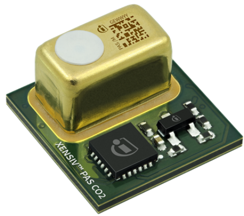

****
Home
****

Welcome to Infineon's XENSIV PAS Gas Sensor Arduino library docs!

.. image:: img/arduino-logo.png
    :height: 150

.. image:: img/pas-gas-r290-module.png
    :height: 100

.. image:: img/pas-gas-a2l-module.png
    :height: 100

.. toctree::
   :maxdepth: 1
   :caption: Content

   self
   getting-started
   hw-platforms
   lib-install
   examples
   api-ref

License
=======

Find the license for this library `here <https://github.com/Infineon/arduino-xensiv-pas-gas-sensor/blob/master/LICENSE.md>`_.